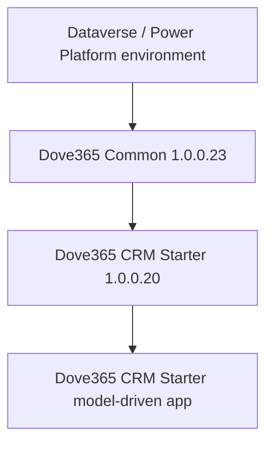
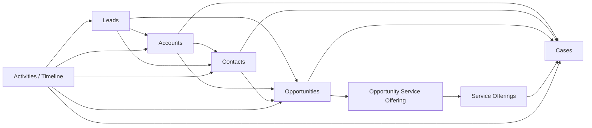

# Solution Architecture

## Product Overview

Dove365 CRM Starter is a productised CRM solution built on Microsoft Power Platform and Dataverse for small to medium-sized businesses. It provides a lightweight CRM covering accounts, contacts, leads, opportunities, service offerings, cases, activities, basic dashboards, SharePoint document management integration, and Outlook/Dynamics email tracking.

The solution is designed as a repeatable starter application rather than a full enterprise CRM implementation. Advanced sales automation, SLA entitlement management, AI features, and invoicing are roadmap or out-of-scope areas unless separately configured.

## Solution Dependency Structure

Dove365 CRM Starter depends on Dove365 Common and must be installed second.

## Common vs CRM Starter Responsibilities

| Layer | Responsibilities |
|---|---|
| Dove365 Common | Shared tables, global choices, service offering foundation, cases, opportunities, business process flows, PCF control, theme assets, web resources, environment variables, service account Outlook connection reference, flow failure notification child flow. |
| Dove365 CRM Starter | Model-driven app, sitemap, lead table and lead conversion process, CRM-specific forms/views, CRM security roles, app module configuration, and user-facing navigation. |

## High-Level Module Structure

## App Navigation Structure

The model-driven app is `Dove365 CRM Starter` with sitemap groups:

- Dashboard: generative CRM data summary page and Activity dashboard.
- Relationship: Accounts, Contacts.
- Pipeline: Leads, Opportunities.
- Service: Cases, Service Offerings.

Design Context: a future HTML training/help page may be embedded directly into the model-driven app once documentation is finalised.

## Core Business Capabilities

- Relationship management for accounts and contacts.
- Lead capture, research, engagement, qualification, conversion, and closure.
- Opportunity tracking through qualify, discovery, proposal, negotiation, won/lost.
- Service offering catalogue for consistent sales and case categorisation.
- Case handling with priority, target dates, escalation, and resolution details.
- Activities, timeline, email tracking, and document integration where platform prerequisites are configured.

## Architecture Principles

- Keep the CRM lightweight and understandable for SMB users.
- Reuse Dataverse platform capabilities before introducing custom automation.
- Keep Common components reusable across future Dove365 apps.
- Keep CRM Starter focused on app-specific navigation, roles, forms, and lead management.
- Make environment-specific values configurable through environment variables and connection references.

## Known Design Decisions

- Dove365 Common is the dependency and must be imported first.
- Common owns reusable choices such as `dove365_priority`, `dove365_source`, `dove365_casetype`, `dove365_billingtype`, `dove365_durationunit`, `dove365_servicecategory`, and `processstage_category`.
- The LinkedIn Badge PCF control is included in Common and used on contact LinkedIn URL fields.
- Common includes two connection references that must both be signed in with the dedicated service account: `dove365_OutlookConnectServiceAccount` (Office 365 Outlook) and `dove365_DataverseConnectionServiceAccount` (Microsoft Dataverse).
- The Power Automate flows in CRM Starter (`Opportunity - Close`, `Case - Resolve`, `Lead - Convert`) replace the previous on-exit classic workflows and use the Dataverse connection reference.
- SharePoint documents are surfaced through standard Dataverse document integration and require environment configuration outside the solution import.

## Future Extension Areas

- Embedded HTML training/help page in the app.
- AI-ready features such as lead summaries, opportunity next-step recommendations, case summaries, follow-up email drafting, and CRM Q&A.
- Advanced sales module for richer service offering, pricing, quote, or proposal scenarios.
- Support module enhancements for SLAs, entitlements, escalation automation, and reporting.

