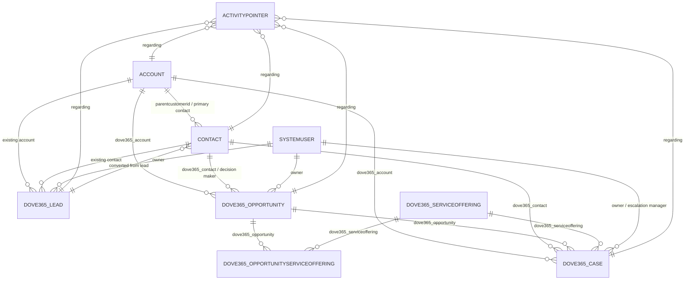

# Data Model and ERD

## Ownership Model

The core custom tables use Dataverse ownership fields (`ownerid`, `owningbusinessunit`, `owningteam`, `owninguser`) where present in the exported metadata. Access is controlled through Dataverse security roles, especially `Dove365 CRM Admin` and `Dove365 CRM User`.

## Core Tables

### Account (`account`)

Standard Dataverse account table. CRM Starter forms expose account name, account number, relationship type, phone, website, parent account, addresses, industry, ownership, employee count, business type, category, billing fields, contact preferences, description, child accounts, opportunities, cases, timeline, and files.

Key Dove365 field:

| Schema name | Type | Use |
|---|---|---|
| `dove365_copymainaddress` | Two options | Copies main address to secondary address through process logic. |

### Contact (`contact`)

Standard Dataverse contact table. CRM Starter forms expose name, job title, email, business phone, mobile phone, converted-from-lead lookup, LinkedIn profile, account, recent opportunities, recent cases, preferences, address, timeline, and files.

| Schema name | Type | Use |
|---|---|---|
| `dove365_linkedinprofile` | URL/text | Stores LinkedIn profile URL and can be rendered by the LinkedIn Badge PCF. |
| `dove365_marketingpreferences` | Multi-select choice | Product Updates, Service Updates, Promotions, Events, Case Studies, Tip Guides, Industry News, Newsletter, Other. |
| `dove365_convertedfromlead` | Lookup | Links a contact back to the lead it was converted from. |

### Lead (`dove365_lead`)

Custom lead table in CRM Starter.

Important fields found in metadata include:

| Schema name | Type | Use |
|---|---|---|
| `dove365_leadname` | Text | Lead name. |
| `dove365_firstname` / `dove365_lastname` / `dove365_fullname` | Text | Person name; `Lead - Build Full Name` supports full name generation. |
| `dove365_accountnameprospect` | Text | Prospect account/company name. |
| `dove365_existingaccount` | Lookup | Existing account identified during research. |
| `dove365_existingcontact` | Lookup | Existing contact identified during research. |
| `dove365_email`, `dove365_businessphone` | Text | Primary communication details. |
| `dove365_leadsource` | Choice | Other, Conference, Network Event, Website Contact Form, Agency, Word of Mouth, Referral. |
| `dove365_temperature` | Choice | Hot, Warm, Cold, Dead. |
| `dove365_qualify` | Two options | Indicates qualification decision. |
| `dove365_convertsummary` | Text | Conversion summary. |
| `dove365_closereason` | Text | Reason when lead is closed rather than converted. |
| `dove365_copymainaddress` | Two options | Supports address copy logic. |

Known status design context: Active, Converted, Inactive.

### Opportunity (`dove365_opportunity`)

Custom opportunity table in Common, extended by CRM Starter forms.

| Schema name | Type | Use |
|---|---|---|
| `dove365_opportunityname` | Text | Opportunity name. |
| `dove365_opportunitynumber` | Text | Opportunity identifier. |
| `dove365_account` | Lookup | Related account. |
| `dove365_contact` | Lookup | Related contact. |
| `dove365_decisionmaker` | Lookup | Contact decision maker. |
| `dove365_opportunityestimate` | Decimal | Early estimated value. |
| `dove365_customerneed` | Multiline text | Discovery/business need. |
| `dove365_budgetconfirmed` | Two options | Budget confirmation. |
| `dove365_timelineconfirmed` | Two options | Timeline confirmation. |
| `dove365_proposedvalue` | Decimal | Proposal value. |
| `dove365_winprobability` | Integer | Win probability. |
| `dove365_proposalsentdate` | Date/time | Proposal sent date. |
| `dove365_competitor` | Text | Competitor. |
| `dove365_approvalrequired` | Two options | Negotiation approval flag. |
| `dove365_estimatedclosedate` | Date/time | Estimated close date. |
| `dove365_actualrevenue` | Decimal | Won revenue. |
| `dove365_lostreason` | Multiline text | Lost reason. |
| `dove365_dealtype` | Choice | New Business, Renewal, Upsell, Support. |
| `dove365_opportunitysource` | Choice | Other, Conference, Network Event, Website Contact Form, Agency, Word of Mouth, Referral. |
| `dove365_priority` | Choice | Uses Common priority. |

Known status design context: New, Engaged, Delayed, Disengaged, Inactive.

### Opportunity Service Offering (`dove365_opportunityserviceoffering`)

Junction table between opportunities and service offerings.

| Schema name | Type | Use |
|---|---|---|
| `dove365_opportunityserviceofferingname` | Text | Display name. |
| `dove365_opportunity` | Lookup | Related opportunity. |
| `dove365_serviceoffering` | Lookup | Related service offering. |

### Service Offering (`dove365_serviceoffering`)

Service catalogue table.

| Schema name | Type | Use |
|---|---|---|
| `dove365_servicename` | Text | Service name. |
| `dove365_servicecode` | Text | Service code. |
| `dove365_servicetype` | Choice | One-Time Service, Recurring Service, Project, Subscription, Package, Retainer, Managed Services, Emergency Services, Scheduled Services, Ad-Hoc, Other. |
| `dove365_servicecategory` | Choice | Service category. |
| `dove365_description` | Multiline text | Description. |
| `dove365_billingtype` | Choice | Common billing type. |
| `dove365_currency` | Lookup | Transaction currency. |
| `dove365_defaultprice` | Decimal | Default price for opportunity-stage use. |
| `dove365_defaultcost` | Decimal | Default cost for reference. |
| `dove365_durationunit` | Choice | Days, Weeks, Months, Years. |
| `dove365_defaultduration` | Whole number | Default duration. |

### Case (`dove365_case`)

Custom case table in Common, presented in CRM Starter.

| Schema name | Type | Use |
|---|---|---|
| `dove365_casename` | Text | Case title/name. |
| `dove365_casenumber` | Text | Case number. |
| `dove365_account` | Lookup | Related account. |
| `dove365_contact` | Lookup | Related contact. |
| `dove365_customer` | Customer | Customer reference. |
| `dove365_opportunity` | Lookup | Related opportunity. |
| `dove365_serviceoffering` | Lookup | Related service offering. |
| `dove365_type` | Choice | Common case type. |
| `dove365_priority` | Choice | Critical, High, Medium, Low. |
| `dove365_source` | Choice | Email, Phone, Website, In Person, Internal, Other. |
| `dove365_targetresolutiondate` | Date/time | Target date. |
| `dove365_casedetails` | Multiline text | Case details. |
| `dove365_internalnotes` | Multiline text | Internal notes. |
| `dove365_nextaction` | Text | Next action. |
| `dove365_escalated` | Two options | Escalation flag. |
| `dove365_escalationmanager` | Lookup | Escalation manager user. |
| `dove365_escalationnotes` | Multiline text | Escalation notes. |
| `dove365_resolution` | Multiline text | Resolution notes. |
| `dove365_resolveddate` | Date/time | Resolved date. |
| `dove365_cancelledreason` | Text | Cancelled reason. |
| `dove365_daysopen` | Whole number | Days open. |

Known status design context: New, Not Started, In Progress, Waiting on Customer, Waiting on Third Party, Delayed, Cancelled, Inactive.

## Business Process Flow Tables

- `dove365_leadconvert`: Lead conversion BPF backing table.
- `dove365_opportunityconvert`: Opportunity conversion BPF backing table.
- `dove365_caseresolve`: Case resolution BPF backing table.

## Mermaid ERD

## Relationship Names Found in Dependencies

- `dove365_case_Account_account`
- `dove365_case_Contact_contact`
- `dove365_contact_dove365_case_808`
- `dove365_case_Opportunity_dove365_opportunity`
- `dove365_opportunityserviceoffering_Opportunity_dove365_opportunity`
- `dove365_case_ServiceOffering_dove365_serviceoffering`
- `dove365_opportunityserviceoffering_ServiceOffering_dove365_serviceoffering`
- `dove365_case_EscalationManager_systemuser`
- `dove365_opportunity_Currency_transactioncurrency`
- `dove365_serviceoffering_Currency_transactioncurrency`

